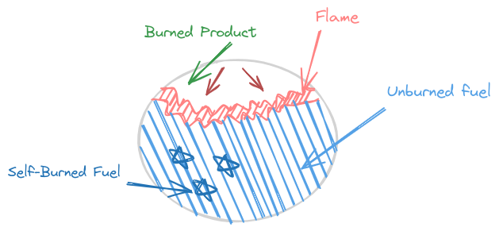

# 导论

## 学习燃烧学的动机
- 为了RBCC!

## 燃烧的定义
- 产生热或同时产生光和热的**快速氧化反应**，也包括只伴随少量热没有光的慢速氧化反应
- 本书值讨论快速反应部分

## 燃烧方式和火焰种类
- 燃烧分类：
    - 有火焰燃烧
        - 预混火焰燃烧：明显化学反应前燃料和氧化剂达到分子水平上的混合
        - 非预混（扩散）火焰燃烧：反应物开始分开，反应只发生在交界面（混合和反应同时发生）
    - 无火焰燃烧

    

- 电火花点火发动机的自点火现象：
    - 三层：已燃产物-火焰-未燃组分混合物
    - **发生激烈的化学反应的薄空间层**就是火焰
    - 随着火焰的运动，未燃组分的温度和压力升高，未燃组分的许多部位在一定条件下发生快速氧化反应，导致整个区域都快速燃烧
    - 压力骤升会导致发动机敲缸，如何减少？
- 湍流非预混火焰：
    - 湍流将燃料和空气在更宏观层面进行**对流混合**
    - 在更小尺度上进行**分子混合**，也即**分子扩散**，完成混合且发生化学反应
- 绝大部分燃烧设备在**湍流流动**中工作
