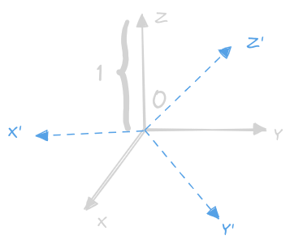
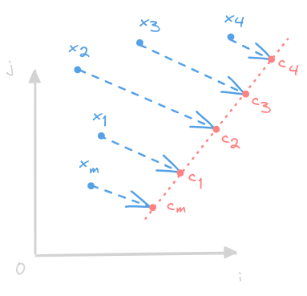

# 线性代数基础

## 量的基本规定
### 标量、向量、矩阵、张量
- 标量：一个单独的数，用 $a,b,c,...$ 表示
- 向量：有序排列的一列数，用 $\bm a, \bm x$ 表示
    $$\bm x = \begin{bmatrix}
    x_{1}\\ x_{2}\\ \vdots\\ x_{n}
    \end{bmatrix}$$
    - 定义 $\bm x_{-j}$ 为除了 $x_{j}$ 以外的所有元素
    - 定义 $S=\{1,3,5\}$, 则 $\bm x_{-S}$ 为除了 $x_{S}$ 以外的所有元素
- 矩阵：二维数组，行$\times$列 ($\bm A: m\times n$)
    $$\bm A = \begin{bmatrix}
    A_{1,1} & A_{1,2} & \cdots & A_{1,n}\\
    A_{2,1} & A_{2,2} & \cdots & A_{2,n}\\
    \vdots  & \vdots  & \ddots & \vdots \\
    A_{m,1}  & A_{m,2}  & \cdots & A_{m,n} \\
    \end{bmatrix}$$
    - 定义 $\bm A_{i,:}$ 为 $\bm A$ 的第 $i$ 行
    - 定义 $\bm A_{:,j}$ 为 $\bm A$ 的第 $j$ 列
    - 定义 $f(\bm A)_{i,j}$ 为函数 $f$ 作用在 $\bm A$ 的第 $i$ 行第 $j$ 列元素
- 张量：超过2维的数组（一个数组的元素分布在若干维坐标的规则网络中），用 $\mathbf A$ 表示张量 $A$

### 矩阵的转置和广播
- 矩阵的转置：（主对角线为**左上到右下**）
    $$(\bm A^{\mathrm T})_{i,j} = \bm A_{j,i}$$
- 转置的运算：
    $$(\bm A+\bm B)^{\mathrm T} = \bm A^{\mathrm T} + \bm B^{\mathrm T}$$
- 用转置定义列向量：
    $$\bm x = 
    \begin{bmatrix}x_{1},x_{2},x_{3}\end{bmatrix}^{\mathrm T} = 
    \begin{bmatrix}x_{1}\\ x_{2}\\ x_{3}\end{bmatrix}$$
- 矩阵相加（维数必须相同）：
    $$(\bm C=\bm A+\bm B)\qquad\iff\qquad \forall i,j(C_{i,j}=A_{i,j}+B_{i,j})$$
- 矩阵与标量相加和相乘：
    $$(\bm D=a\cdot\bm A+c)\qquad\iff\qquad \forall i,j(D_{i,j}=a\cdot A_{i,j}+c)$$
- 矩阵和向量的相加（广播，也即 $\bm b^{\mathrm T}$ 与 $\bm A$ 的每一行相加）：
    $$(\bm C=\bm A+\bm b^{\mathrm T})\qquad\iff\qquad \forall i,j(C_{i,j}=A_{i,j}+b_{j})$$

## 矩阵与向量相乘
- 矩阵乘积（要求：$A_{m\times p}$，$B_{p\times n}$，也即 $C_{m\times n}$ ）：
    $$(\bm C=\bm A\times\bm B)\qquad \iff \qquad \forall i,j\left(C_{i,j}=\sum_{k}A_{i,k}B_{k,j}\right)$$
- 矩阵的哈达马积（元素对应乘积，要求$A_{m\times n}$，$B_{m\times n}$，也即 $C_{m\times n}$）：
    $$(\bm C=\bm A\odot\bm B)\qquad \iff \qquad \forall i,j\left(C_{i,j}=A_{i,j}B_{i,j}\right)$$
- 向量的点积（向量维数相同）：
    $$\bm x^{\mathrm T}\bm y = \sum_{k}x_{k}y_{k} = \bm y^{\mathrm T}\bm x$$
- 矩阵乘积用向量乘积表示（$\bm A$ 看成横向量的组合，$\bm B$ 看成列向量的组合）：
    $$\bm A\bm B = \begin{bmatrix}
    \bm a^{\mathrm T}_{1}\\
    \bm a^{\mathrm T}_{2}\\
    \vdots\\
    \bm a^{\mathrm T}_{m}\\
    \end{bmatrix}\begin{bmatrix}
    \bm b^{\mathrm T}_{1}&\bm b^{\mathrm T}_{2}&\cdots &\bm b^{\mathrm T}_{n}
    \end{bmatrix} = \begin{bmatrix}
    \bm a^{\mathrm T}_{1}\bm b_{1} & \bm a^{\mathrm T}_{1}\bm b_{2}&\cdots&\bm a^{\mathrm T}_{1}\bm b_{n}\\
    \bm a^{\mathrm T}_{2}\bm b_{1} & \bm a^{\mathrm T}_{2}\bm b_{2} & \cdots & \bm a^{\mathrm T}_{2}\bm b_{n}\\
    \vdots  & \vdots  & \ddots & \vdots \\
    \bm a^{\mathrm T}_{m}\bm b_{1} & \bm a^{\mathrm T}_{m}\bm b_{2}  & \cdots & \bm a^{\mathrm T}_{m}\bm b_{n}\\
    \end{bmatrix}$$
- 分配律与结合律：
    $$\begin{align*}
    \bm A(\bm B+\bm C) &= \bm A\bm B + \bm A\bm C\\
    \bm A(\bm B\bm C) &= (\bm A\bm B)\bm C
    \end{align*}$$
- 乘积的转置：
    $$(\bm A\bm B)^{\mathrm T} = \bm B^{\mathrm T}\bm A^{\mathrm T}$$
- 线性方程组（$\bm A$ 的横向量的每个元素为对应线性方程的系数）：
    $$\bm A\bm x = \bm b$$
    - $\bm A\in \mathbb R^{m\times n}$
    - $\bm x\in \mathbb R^{n}$
    - $\bm b\in \mathbb R^{m}$

## 单位矩阵和逆矩阵
- 单位矩阵 $\bm I_{n}\in \mathbb R^{n\times n}$：
    $$\forall \bm x\in \mathbb R^{n},\qquad \bm I_{n}\bm x = \bm x$$
- 对于 $\bm A\in \mathbb R^{n}$ ，如果存在逆矩阵，则：
    $$\bm A^{-1}\bm A = \bm I_{n}$$
- 利用逆矩阵求解 $\bm A\bm x=\bm b$：
    $$(\bm A\bm x=\bm b)\implies(\bm A^{-1}\bm A\bm x=\bm A^{-1}\bm b)\implies
    (\bm I_{n}\bm x=\bm A^{-1}\bm b)\implies (\bm x = \bm A^{-1}\bm b)$$

## 线性相关与生成子空间
- 如果 $\bm A$ 的逆矩阵存在，则对于每一个 $\bm b$ 都恰好只有一个解 $\bm x$
- 如果有多个解，比如说 $\bm x$ 和 $\bm y$ 都是方程的解，则：
    $$\bm z = \alpha\bm x+(1-\alpha)\bm y$$
    也是方程的解，其中 $\alpha$ 为任意实数
- 将矩阵 $\bm A$ 展开为列向量的组合：
    $$\bm A = \begin{bmatrix} \bm a_{1}&\bm a_{2}&\cdots &\bm a_{n} \end{bmatrix}$$
    则原方程变形：
    $$(\bm A\bm x=\bm b)\implies\left(\sum_{k}\bm a_{k}x_{k} = \bm b\right)$$
    其中右式等号左侧即为 $\bm A$ 的列向量组的生成子空间，也叫做 $\bm A$ 的**列空间**或**值域**
- 线性相关：一组向量中的任意一个向量都可以由该组其他向量线性表示
- $\bm A\bm x=\bm b$ 有解的**充分必要条件**：
    $$\mathrm{dim}(\bm A_{m\times n})\ = \mathrm{dim}(\bm a_{1},\bm a_{2},\cdots, \bm a_{n}) = \mathrm{dim}(\bm b) = m$$
    也即 $\bm A$ 的**列空间的维数**必须等于 $m$
- 矩阵可逆：$\bm A$ 为方阵（$m=n$）且**列向量线性无关**
- 奇异矩阵：$\bm A$ 的列向量线性相关

## 范数
- 衡量**向量的大小**，其中 $L^{p}$ 范数：
    $$\Vert \bm x \Vert_{p} = \left(\sum_{i}\vert x_{i}\vert^{p}\right)^{\frac{1}{p}}$$
    其中 $(p\in \mathbb R)\wedge(p\geq 1)$
- $L^{2}$：欧几里德范数
    $$\Vert \bm x\Vert = \bm x^{\mathrm T}\bm x$$
- $L^{1}$ 范数：
    $$\Vert \bm x\Vert_{1} = \sum_{k}\vert x_{k}\vert$$
- $L^{0}$ 范数：向量中非零元素的个数（较少用）
- $L^{\infty} 范数（**最大范数**）：
    $$\Vert \bm x\Vert_{\infty} = \max_{i}\vert x_{i}\vert$$
- 用欧几里德范数表示向量的点积：
    $$\bm x^{\mathrm T}\bm y = \Vert x\Vert\Vert y\Vert\cos\theta$$
    其中 $\theta$ 为 $\bm x$ 和 $\bm y$ 的夹角
- 矩阵的大小：**Frobenius 范数** 
    $$\Vert\bm A\Vert_{F} = \sqrt{\sum_{i}\sum_{j}A_{i,j}^{2}}$$

## 特殊类型的矩阵和向量
- 对角矩阵：主对角线含有非零元素外其他都是零
    $$(\bm v = \begin{bmatrix} v_{1} & v_{2} & \cdots & v_{n}\end{bmatrix})\implies
    \left(\mathrm{diag}(\bm v) = \begin{bmatrix}
    v_{1} & 0 & \cdots & 0\\
    0 & v_{2} & \cdots & 0\\
    \vdots & \vdots & \ddots & \vdots\\
    0 & 0 & \cdots & v_{n}
    \end{bmatrix}\right)$$
    对角矩阵和向量相乘：
    $$\mathrm{diag}(\bm v)\bm x = \bm v\odot \bm x$$
    作为方阵的对角矩阵的逆矩阵：
    $$\mathrm{diag}(\bm v)^{-1} = \mathrm{diag}\left(
    \begin{bmatrix}
    v_{1}&v_{2}&\cdots&v_{n}
    \end{bmatrix}
    ^{\mathrm T}\right)^{-1} = \mathrm{diag}\left(
    \begin{bmatrix}
    \displaystyle\frac{1}{v_{1}}&
    \displaystyle\frac{1}{v_{2}}&\cdots&
    \displaystyle\frac{1}{v_{n}}
    \end{bmatrix}
    ^{\mathrm T}\right)$$
    并非所有的对角矩阵都是方阵（只要有主对角线）
- 对称矩阵：
    $$(\bm A = \bm A^{\mathrm T})\qquad\implies\qquad\forall i,j(A_{i,j}=A_{j,i})$$
- 单位向量：具有单位范数的向量：
    $$\Vert \bm \Vert_{2} = 1$$
- 正交向量：
    $$\bm x^{\mathrm T}\bm y = 0$$
    若 $\bm x$ 与 $\bm y$ 均有**非零范数**，则 $\bm x$ 和 $\bm y$ 之间的夹角为 $90^{\circ}$，且在 $\mathbb R^{n}$ 中最多有 $n$ 个范数非零向量相互正交。
- 标准正交向量：若 $\bm x$ 和 $\bm y$ 的范数满足：
    $$\Vert \bm x\Vert = \Vert\bm y\Vert = 1$$
    则 $\bm x$ 和 $\bm y$ 为**标准正交**
- 正交矩阵：行向量和列向量**分别标准正交**的**方阵**
    $$\bm A^{\mathrm T}\bm A = \bm A\bm A^{\mathrm T} = \bm I$$
    也即：
    $$\bm A^{-1} = \bm A^{\mathrm T}$$
    正交矩阵的列向量为标准正交基，可以堪称坐标轴上的单位向量进行“旋转”:
    

        
    

    注意，行向量或列向量互相正交但不是标准正交的，没有对应的专业名词！

## 特征分解
- 考虑**方阵** $\bm A$，其特征方程为：
    $$\bm A\bm v = \lambda \bm v$$
    这里更关注**右特征向量**（且特征向量不为$\bm 0$！！），也即 $\bm v$，其中 $\lambda$ 为特征值，且：
    $$\forall s\neq 0\left((\bm A\bm v = \lambda \bm v)\implies(\bm A (s\bm v) = \lambda(s\bm v))\right)$$
    因此，一般取**单位特征向量**，为求解特征值，可以将特征方程变形：
    $$(\bm A-\lambda\bm I)\bm v=\bm 0$$
    由于特征向量**不全为**0向量，因此矩阵 $(\bm A-\lambda\bm I)$ 的**列向量线性相关**，则行列式为0：
    $$\mathrm{det}(\bm A-\lambda\bm I) = 0$$
    应当注意，不同的特征值对应的特征向量**彼此线性无关**（如果线性相关，则特征向量可以用其他特征向量线性表示，这就又回到了**倍增同特征**问题），但是不一定正交！
- 设 $\bm A$ 有 $n$ 个线性无关的特征向量，构成一个矩阵（该矩阵**可逆**）：
    $$\bm V = \begin{bmatrix}\bm v_{1}&\bm v_{2}&\cdots&\bm v_{n}\end{bmatrix}$$
    对应 $n$ 个特征值，构成一个向量：
    $$\bm \lambda = \begin{bmatrix} \lambda_{1}&\lambda_{2}&\cdots&\lambda_{n}\end{bmatrix}$$
    $\bm A$ 可以进行**特征分解**，首先排列各线性无关的特征向量：
    $$\begin{align*}
    \bm A\bm v_{1} &=\lambda_{1}\bm v_{1}\\
    \bm A\bm v_{2} &=\lambda_{2}\bm v_{2}\\
    &\vdots\\
    \bm A\bm v_{n} &=\lambda_{n}\bm v_{n}\\
    \end{align*}$$
    变形为矩阵相乘的形式：
    $$\bm A\begin{bmatrix}\bm v_{1}&\bm v_{2}&\cdots&\bm v_{n}\end{bmatrix} = 
    \begin{bmatrix}\bm v_{1}&\bm v_{2}&\cdots&\bm v_{n}\end{bmatrix}\mathrm{diag}(\bm\lambda)$$
    也即：
    $$\bm A\bm V = \bm V\mathrm{diag}(\bm\lambda)$$
    取 $\bm V$ 的逆矩阵后得到 $\bm A$ 的 **特征分解** 
    $$\bm A = \bm V\mathrm{diag}(\bm \lambda)\bm V^{-1}$$
    - 若 $\bm A$ 有 $n$ 个彼此线性无关的特征向量（特征值几何重数等于代数重数），则 $\bm A$ 可以特征分解
    - 若 $\bm A$ **可逆**，则 $\bm A$ 有 $n$ 个**非零**特征值（不一定可以特征分解！）
    - $\bm A$ 的列空间的维数大于等于非零特征值的个数
- 如果 $A$ 为**实对称矩阵**：
    $$\bm A=\bm A^{\mathrm T}$$
    对于任意的两个特征值 $\lambda_{i},\lambda_{j}$ 对应的特征向量 $\bm v_{i}, \bm v_{j}$，满足：
    $$\begin{align*}
    \bm A\bm v_{i} &= \lambda_{i}\bm I\bm v_{i}\\
    \bm A\bm v_{j} &= \lambda_{j}\bm I\bm v_{j}
    \end{align*}
    $$
    则：
    $$\lambda_{i}\bm v_{i}^{\mathrm T}\bm v_{j} = (\lambda_{i}\bm v_{i})^{\mathrm T}\bm v_{j} = (\bm A\bm v_{i})^{\mathrm T}\bm v_{j} = \bm v_{i}^{\mathrm T}\bm A^{\mathrm T}\bm v_{j}$$
    也即 $\bm v_{i}$ 和 $\bm v_{j}$ 满足：
    $$\lambda_{i}\bm v_{i}^{\mathrm T}\bm v_{j}=\bm v_{i}^{\mathrm T}\bm A^{\mathrm T}\bm v_{j}=\bm v_{i}^{\mathrm T}\bm A\bm v_{j}=\bm v_{i}^{\mathrm T}(\bm A\bm v_{j}) = \bm v_{i}^{\mathrm T}(\lambda_{j}\bm v_{j})=\lambda_{j}\bm v_{i}^{\mathrm T}\bm v_{j}$$
    但是 $\lambda_{i}\neq\lambda_{j}$，因此一定有:
    $$\bm v_{i}^{\mathrm T}\bm v_{j}=0$$
    注意，[实对称矩阵的列空间与零空间彼此正交](./Addition/实对称矩阵可特征对角化的证明.md)
    实对称矩阵可以正交对角化可以用[谱定理(?)]()和相似不变性证明：
    $$\mathrm{dim}(C(\bm A)) +\mathrm{dim}(N(\bm A)) = n$$
    也即实对称矩阵的代数重数一定等于几何重数！也即**实对称矩阵的特征矩阵为正交矩阵，特征向量彼此正交！因此也可以化成标准正交的形式！**，也即：
    $$\bm A = \bm Q\bm \Lambda\bm Q^{-1} = \bm Q\bm \Lambda\bm Q^{\mathrm T}$$
    按约定，降序排列 $\bm\Lambda$ 的元素
- 特征值的特性：
    - 正定矩阵：所有特征值为正数，满足：
        $$\forall\bm x\left((\bm x^{\mathrm T}\bm A\bm x = 0)\implies(\bm x=\bm 0)\right)$$
    - 半正定矩阵：所有特征值为非负数
        $$\forall \bm x(\bm x^{\mathrm T}\bm A\bm x \geq 0)$$
    - 负定矩阵：所有特征值为负数
    - 半负定矩阵：所有特征值为非正数
## 奇异值分解（SVD）
- 对于一个 $m\times n$ 的矩阵 $\bm A$：
    $$\bm A = \bm U\bm D\bm V^{\mathrm T}$$
    - $\mathrm{dim}(\bm U) = m\times m$
    - $\mathrm{dim}(\bm D) = m\times n$
    - $\mathrm{dim}(\bm V) = n\times n$
- 三个矩阵的特性：
    - $\bm D$ 为对角矩阵，对角线上的元素为 $\bm A$ 的**奇异值**
    - $\bm U$ 为正交矩阵，列向量为 **左奇异向量**
    - $\bm V$ 为正交矩阵，列向量为 **右奇异向量**
- 用特征分解解释奇异值分解：
    $$\begin{align*}
    \bm A\bm A^{\mathrm T} &= \bm U\bm D\bm V^{\mathrm T}\bm V\bm D^{\mathrm T}\bm U^{\mathrm T}\\
    \bm A^{\mathrm T}\bm A &= \bm V\bm D^{\mathrm T}\bm U^{\mathrm T}\bm U\bm D\bm V^{\mathrm T}\\
    \end{align*}$$
    - $\bm A$ 的**左奇异向量**是 $\bm A\bm A^{\mathrm T}$ 的特征向量
    - $\bm A$ 的**右奇异向量**是 $\bm A^{\mathrm T}\bm A$ 的特征向量
    - $\bm A$ 的**非零奇异值**是 $\bm A\bm A^{\mathrm T}$ 特征值的平方根，也是 $\bm A^{\mathrm T}\bm A$ 特征值的平方根

[奇异值分解的原理和伪逆矩阵求解线性方程组的原理？]()

## Moore-Penrose 伪逆
- 非方矩阵没有逆矩阵，但是我们想通过求 $\bm A$ 的左逆 $\bm B$ 来求解：
    $$\bm A\bm x=\bm b$$ 
- 定义 $\bm A$ 的伪逆：
    $$\bm A^{+} = \lim_{\alpha\rightarrow 0}(\bm A^{\mathrm T}\bm A+\alpha \bm I)^{-1}\bm A^{\mathrm T}$$
    为便于计算，可以使用：
    $$\bm A^{+} = \bm V\bm D^{+}\bm U^{\mathrm T}$$
    其中 $\bm D^{+}$ 为 $\bm D$ 的非零元素取倒数后转置得到
- 注意：
    $$\bm x = \bm A^{+}\bm b$$
    是方程所有可行解中欧几里德范数 $\Vert \bm x\Vert$ **最小**的一个
- 列数多于行数可能可以用伪逆求解法，但是行数多于列数可能没有解，此时伪逆求解得到的 $\bm x$ 使得：
    $$\Vert\bm A\bm x-\bm b\Vert$$
    **最小**，也即 $\bm A\bm x$ 和 $\bm b$ 之间的**欧几里德距离**最小

## 迹运算
- 迹返回的是矩阵对角元素之和：
    $$\mathrm{tr}(\bm A) = \sum_{i}\bm A_{i,i}$$
- 用迹计算 Frobenius 范数：
    $$\Vert\bm A\Vert_{F} = \sqrt{\sum_{i}\sum_{j}\bm A_{i,j}^{2}} = \sqrt{\mathrm{tr}(\bm A\bm A^{T})} = \sqrt{\mathrm{tr}(\bm A^{T}\bm A)}$$
- 迹运算的特性：
    $$\begin{align*}
    \mathrm{tr}(\bm A) &= \mathrm{tr}(\bm A^{\mathrm T})\\
    \mathrm{tr}(\bm A\bm B) &= \mathrm{tr}(\bm B\bm A)\\
    \end{align*}$$
    注意，对于多个矩阵相乘的迹，只有按**循环置换**改变相乘顺序且乘积**仍然定义良好**，矩阵的迹才不变：
    $$\mathrm{tr}\left(\prod_{i=1}^{n}\bm F_{i}\right) = \mathrm{tr}\left(\bm F_{n}\prod_{i=1}^{n-1}\bm F_{i}\right)$$

## 行列式
- 二维矩阵的行列式：
    $$\vert\bm A\vert = \begin{vmatrix}
    A_{1,1} & A_{1,2}\\
    A_{2,1} & A_{2,2}\\
    \end{vmatrix} = A_{1,1}A_{2,2}-A_{1,2}A_{2,1}$$ 
- 只有方阵有行列式：
    $$\vert\bm A\vert =
    \begin{vmatrix}
    A_{1,1} & A_{1,2} & \cdots & A_{1,n}\\
    A_{2,1} & A_{2,2} & \cdots & A_{2,n}\\
    \vdots  & \vdots  & \ddots & \vdots \\
    A_{m,1}  & A_{m,2}  & \cdots & A_{m,n} \\
    \end{vmatrix}$$
- 行列式可以进行**降维运算**，按行展开或按列展开，对第 $i$ 列展开为例：
    $$\vert\bm A\vert = \sum_{k=1}^{n}A_{k,i}\vert \bm A_{k,i}\vert$$
    其中 $\vert \bm A_{k,i}\vert$ 为擦去第 $k$ 行和 第 $i$ 列之后剩下的矩阵的行列式
- 利用行列式求矩阵的逆：
    $$\bm A^{-1} = \frac{1}{\vert\bm A\vert}\mathrm{adj}(\bm A)^{\mathrm T} = \frac{1}{\vert\bm A\vert}
    \begin{bmatrix}
    \vert \bm A_{1,1}\vert & \vert \bm A_{1,2}\vert & \cdots & \vert \bm A_{1,n}\vert \\
    \vert \bm A_{2,1}\vert & \vert \bm A_{2,2}\vert & \cdots & \vert \bm A_{2,n}\vert \\
    \vdots & \vdots & \ddots & \vdots\\ 
    \vert \bm A_{n,1}\vert & \vert \bm A_{n,2}\vert & \cdots & \vert \bm A_{n,n}\vert \\
    \end{bmatrix}^{\mathrm T}$$
    其中 $\mathrm{adj}(\bm A)$ 为**伴随矩阵**
[逆矩阵按行按列展开的原理？]()

## 主成分分析（PCA）
- 在 $\mathbb R^{n}$ 中有 $m$ 个点：
    $$\begin{bmatrix}
    \bm x_{1} & \bm x_{2} & \cdots & \bm x_{m}
    \end{bmatrix}$$
- 对于每一个 $\bm x_{i}\in \mathbb R^{n}$，用编码向量 $\bm c_{i}\in \mathbb R^{p}$ **对应表示来完成有损压缩**，令 $p < n$，则实现了更小内存储存原数据
    

        
    

- 目标：对于每个特定的输入向量 $\bm x$，找到函数 $f$ 和 $g$
    $$\begin{align*}
    \mathrm{Encode: } &f(\bm x) = \bm c\\
    \mathrm{Decode: } &g(f(\bm x)) = g(\bm c) \approx \bm x
    \end{align*}$$
    为简化解码器，使用矩阵乘法：
    $$g(\bm c) = \bm D\bm c$$
    其中**编码矩阵** $\bm D\in \mathbb R^{n\times p}$，并且限制 $\bm D$ 的列向量具有**单位范数**，并且**彼此正交**
> 得到最优编码 $\bm c^{*}$ 的方法：类似于**最小二乘法**，应当使得欧几里德范数最小
- 也即：
    $$\bm c^{*} = \arg\min\Vert \bm x-g(\bm c)\Vert^{2} = \arg\min(\bm x-g(\bm c))^{\mathrm T}(\bm x-g(\bm c))$$
    其中 $\arg$ 为某种意义上的“反函数”，展开得到：
    $$
    \Vert\bm x-g(\bm c)\Vert^{2} = (\bm x-g(\bm c))^{\mathrm T}(\bm x-g(\bm c)) = \bm x^{\mathrm T}\bm x -2\bm x^{\mathrm T}g(\bm c) + g(\bm c)^{\mathrm T}g(\bm c)
    $$
    而 $\bm x^{\mathrm T}\bm x$ 不依赖于 $\bm c$ 可以忽略，注意 $\bm D$ 的正交性，可以得到**目标函数**：
    $$
    \begin{align*}
    \bm c^{*} &= \arg\min(-2\bm x^{\mathrm T}g(\bm c) + g(\bm c)^{\mathrm T}g(\bm c))\\
    &= \arg\min(-2\bm x^{\mathrm T}\bm D\bm c + \bm c^{\mathrm T}\bm D^{\mathrm T}\bm D\bm c)\\
    &= \arg\min(-2\bm x^{\mathrm T}\bm D\bm c + \bm c^{\mathrm T}\bm I_{m}\bm c)\\
    &= \arg\min(-2\bm x^{\mathrm T}\bm D\bm c + \bm c^{\mathrm T}\bm c)
    \end{align*}$$
- 求解目标函数的最小值：
    $$h(\bm c) = -2\bm x^{\mathrm T}\bm D\bm c + \bm c^{\mathrm T}\bm c$$
    本质是多元函数的条件极值问题：
    $$h(c_{1},c_{2},\dots,c_{p}) = -2L(c_{1},c_{2},\dots,c_{p}) + \sum_{i=1}^{p}c_{i}^{2}$$
    其中 $L(c_{1},c_{2},\dots,c_{p})$ 为系数已知的 $\bm c$ 的线性组合（给定输入 $\bm x$ 和 编码矩阵 $\bm D$）：
    $$L(c_{1},c_{2},\dots,c_{p}) = \sum_{i=1}^{p}L_{i}c_{i} = \sum_{i=1}^{p}(\bm x^{\mathrm T}\bm D_{:,i})c_{i}$$
    依次求偏导数，取极值：
    $$
    \begin{align*}
    \frac{\partial h}{\partial c_{1}} &= -2\bm x^{\mathrm T}\bm D_{:,1}+2c_{1} = 2(-\bm x^{\mathrm T}\bm D_{:,1}+c_{1}) = 0\\
    \frac{\partial h}{\partial c_{2}} &= -2\bm x^{\mathrm T}\bm D_{:,2}+2c_{2} = 2(-\bm x^{\mathrm T}\bm D_{:,2}+c_{2}) = 0\\
    &\vdots\\
    \frac{\partial h}{\partial c_{p}} &= -2\bm x^{\mathrm T}\bm D_{:,p}+2c_{p} = 2(-\bm x^{\mathrm T}\bm D_{:,p}+c_{p}) = 0\\
    \end{align*}
    $$
    合并成矩阵表示：
    $$-2(\bm x^{\mathrm T}D + c^{\mathrm T}) = \bm 0$$
    取转置：
    $$-2(\bm D^{\mathrm T}\bm x + \bm c) = \bm 0$$
    也即：
    $$\bm c^{*} = f(\bm x) = \bm D^{\mathrm T}\bm x$$
    应当注意，在求解极值的时候，所有的偏导数都是单调递增的，在对应的方向上都存在极值，因此得到的 $\bm c^{*}$ 一定是**极小值**，综上：
    $$
    \begin{align*}
    f(\bm x) &= \bm D^{\mathrm T} \bm x\\
    g\left(f(\bm x)\right) &= \bm D\bm D^{\mathrm T} \bm x\\
    \end{align*}
    $$
> 挑选编码矩阵 $\bm D$：应该**最小化**所有维数和所有点的**误差向量的范数**
- 也即：
    $$\bm D^{*} = \arg\min\sqrt{\sum_{i}\left(\bm x_{i}-g(f(\bm x_{i}))\right)^{2}}\qquad \mathrm{s.t.}\,\,\bm D^{\mathrm T}\bm D=\bm I_{m}$$
    考虑 $p=1$ 的情况，此时 $\bm D = \bm d\in \mathbb R^{n\times 1}$，此时问题简化为：
    $$\bm d^{*} = \arg\min\sqrt{\sum_{i}\left(\bm x_{i}-\bm d\bm d^{\mathrm T}\bm x_{i}\right)^{2}}\qquad \mathrm{s.t.}\,\,\Vert\bm d\Vert=1$$
    将目标向量进行堆叠，写成矩阵的形式：
    $$\bm X = \begin{bmatrix}
    \bm x_{1}&\bm x_{2}&\cdots&\bm x_{m}
    \end{bmatrix}$$
    此时问题可以写成带有矩阵的**Frobenius**范数的形式：
    $$\bm d^{*} = \arg\min\Vert\bm X-\bm d\bm d^{\mathrm T}\bm X\Vert_{F}^{2}\qquad \mathrm{s.t.}\,\,\bm d^{\mathrm T}\bm d=1$$
    利用迹运算和Frobenius范数的关系，改写成：
    $$
    \begin{align*}
    \bm d^{*} &= \arg\min\Vert\bm X-\bm d\bm d^{\mathrm T}\bm X\Vert_{F}^{2}\\
    &=\arg\min\mathrm{tr}\left((\bm X-\bm d\bm d^{\mathrm T}\bm X)^{\mathrm T}(\bm X-\bm d\bm d^{\mathrm T}\bm X)\right)\\
    &=\arg\min\mathrm{tr}\left((\bm X^{\mathrm T}-\bm X^{\mathrm T}\bm d\bm d^{\mathrm T})(\bm X-\bm d\bm d^{\mathrm T}\bm X)\right)\\
    &=\arg\min\mathrm{tr}(\bm X^{\mathrm T}\bm X-2\bm X^{\mathrm T}\bm d\bm d^{\mathrm T}\bm X+\bm X^{\mathrm T}\bm d\bm d^{\mathrm T}\bm d\bm d^{\mathrm T}\bm X)
    \end{align*}
    \qquad\mathrm{s.t.}\,\,\bm d^{\mathrm T}\bm d=1$$
    由于约束条件，进一步改写成：
    $$
    \begin{align*}
    \bm d^{*}&=\arg\min\mathrm{tr}(\bm X^{\mathrm T}\bm X-2\bm X^{\mathrm T}\bm d\bm d^{\mathrm T}\bm X+\bm X^{\mathrm T}\bm d\bm d^{\mathrm T}\bm X)\\
    &=\arg\min\mathrm{tr}(\bm X^{\mathrm T}\bm X-\bm X^{\mathrm T}\bm d\bm d^{\mathrm T}\bm X)
    \end{align*}
    \qquad\mathrm{s.t.}\,\,\bm d^{\mathrm T}\bm d=1
    $$
    忽略和 $\bm d$ 无关的项，得到目标函数：
    $$
    \begin{align*}
    \bm d^{*} &= \arg\min\mathrm{tr}(-\bm X^{\mathrm T}\bm d\bm d^{\mathrm T}\bm X)\\
        &=\arg\max\mathrm{tr}(\bm X^{\mathrm T}\bm d\bm d^{\mathrm T}\bm X)\\
    \end{align*}
    \qquad\mathrm{s.t.}\,\,\bm d^{\mathrm T}\bm d=1
    $$
    注意，若**按照循环置换**改变相乘顺序，方阵的迹不变，改写成：
    $$
    \begin{align*}
    \bm d^{*} 
        &=\arg\max\mathrm{tr}(\bm X\bm X^{\mathrm T}\bm d\bm d^{\mathrm T})\\
        &=\arg\max\mathrm{tr}(\bm d^{\mathrm T}\bm X\bm X^{\mathrm T}\bm d)\\
    \end{align*}
    \qquad\mathrm{s.t.}\,\,\bm d^{\mathrm T}\bm d=1
    $$
- 注意，这里的 $\bm X$ 是**以列为样本**进行堆叠：
    $$\bm X_{:,j} = \bm x_{j}$$
    部分教材是**以行为样本**进行堆叠：
    $$\bm X_{i,:} = \bm x_{i}^{\mathrm T}$$
    如果是**以行为样本**进行堆叠，则 $\bm X$ 需要取转置，得到目标函数为：
    $$
    \begin{align*}
    \bm d^{*} 
        &=\arg\max\mathrm{tr}(\bm d^{\mathrm T}\bm X^{\mathrm T}\bm X\bm d)\\
    \end{align*}
    \qquad\mathrm{s.t.}\,\,\bm d^{\mathrm T}\bm d=1
    $$
- **以列为样本**进行堆叠，求解目标函数：
    $$
    \begin{align*}
    \bm d^{*} 
        &=\arg\max\mathrm{tr}(\bm d^{\mathrm T}\bm X\bm X^{\mathrm T}\bm d)\\
    \end{align*}
    \qquad\mathrm{s.t.}\,\,\bm d^{\mathrm T}\bm d=1
    $$
    注意到 $\bm X\bm X^{\mathrm T}$ 是**实对称矩阵**且是**半正定矩阵**，进行正交分解：
    $$\bm X\bm X^{\mathrm T} = \bm Q\bm\Lambda\bm Q^{\mathrm T}$$
    其中 $\bm Q\in \mathbb R^{n}$ 满足：
    $$\bm Q^{\mathrm T} = \bm Q^{-1}$$
    将 $\bm \Lambda\in\mathbb R^{n}$ 上的元素降序排列得到：
    $$\bm \Lambda = \mathrm{diag}(\bm\lambda) = \begin{bmatrix}
    \lambda_{1} & 0 & \cdots & 0\\
     0 & \lambda_{2} & \cdots & 0\\
     \vdots & \vdots & \ddots & \vdots\\
     0 & 0 & \cdots & \lambda_{n}
    \end{bmatrix}
    \qquad\mathrm{s.t.}\,\,\lambda_{1}\geq\lambda_{2}\geq\cdots\geq\lambda_{n}$$
    代入后得到：
    $$
    \begin{align*}
    \bm d^{*} 
        &=\arg\max\mathrm{tr}(\bm d^{\mathrm T}\bm Q\bm \Lambda\bm Q^{\mathrm T}\bm d)\\
    \end{align*}
    \qquad\mathrm{s.t.}\,\,\bm d^{\mathrm T}\bm d=1
    $$
    注意：
    $$
    \left((\bm Q^{\mathrm T}\bm Q=\bm Q\bm Q^{\mathrm T}=\bm I_{n})\wedge(\bm d^{\mathrm T}\bm d=1)\right)
    \implies
    \left((\bm d^{\mathrm T}\bm Q)(\bm Q^{\mathrm T}\bm d)=(\bm Q^{\mathrm T}\bm d)^{\mathrm T}(\bm Q^{\mathrm T}\bm d)=1\right)
    $$
    令 $\bm Q^{\mathrm T}\bm d=\bm y$，也即 $\bm y^{\mathrm T}\bm y=1$ 则可以得到：
    $$
    \begin{align*}
    \bm d^{*} 
        &=\arg\max\mathrm{tr}(\bm y^{\mathrm T}\bm \Lambda\bm y)\\
    \end{align*}
    \qquad\mathrm{s.t.}\,\,\bm y^{\mathrm T}\bm y=1
    $$
    由于 $\bm\Lambda$ 为对角矩阵，可以直接写成：
    $$
    \begin{align*}
    \bm d^{*} 
        &=\arg\max\sum_{i=1}^{n}\lambda_{i}y_{i}^{2}\\
    \end{align*}
    \qquad\mathrm{s.t.}\,\,\bm y^{\mathrm T}\bm y=1
    $$
    由于：
    $$\bm y^{\mathrm T}\bm y = \sum_{i=1}^{n}y_{i}^{2}=1$$
    因此：
    $$\sum_{i=1}^{n}\lambda_{i}\bm y_{i}^{2}=
    \begin{bmatrix}
    \lambda_{1} & \lambda_{2} & \cdots & \lambda_{n}
    \end{bmatrix}
    \begin{bmatrix}
    y^{2}_{1} \\ y^{2}_{2} \\ \vdots \\ y^{2}_{n}
    \end{bmatrix}
    \leq
    \begin{bmatrix}
    \lambda_{1} & \lambda_{1} & \cdots & \lambda_{1}
    \end{bmatrix}
    \begin{bmatrix}
    y^{2}_{1} \\ y^{2}_{2} \\ \vdots \\ y^{2}_{n}
    \end{bmatrix}=\lambda_{1}
    $$
    当且仅当 $\vert y_{1}\vert =1$ 且 $y_{2}=y_{3}=\cdots=y_{n}=0$ 时成立，此时：
    $$(\bm y = \bm Q^{\mathrm T}\bm d)\implies(\bm d=\bm Q\bm y = \bm Q\begin{bmatrix}
    1 & 0 &\cdots & 0
    \end{bmatrix}^{\mathrm T})$$
    也即 $\bm d$ 取了 $\bm Q$ 的第一列，而 $\bm Q$ 的第一列恰为 $\bm X\bm X^{\mathrm T}$ 的 $\lambda_{1}$ 也即**最大特征值对应的特征向量！**
> 结论：
> - 最优的 $\bm d^{*}$ 为 $\bm X\bm X^{\mathrm T}$ 最大特征值对应的特征向量
> - 利用数学归纳法可以得到，$\bm D^{*}$ 由 $\bm X\bm X^{\mathrm T}$ 的前 $p$ 个最大特征值对应的特征向量组成
> - 利用 $\bm D^{*}$ ，可以得到对应的最优编码为：$\bm c^{*}=(\bm D^{*})^{\mathrm T}\bm x$

### 数学归纳法证明：
目标：
$$\forall p\in\mathbb N^{+}(\bm D_{n\times p}^{*}
        =\arg\max\mathrm{tr}(\bm D^{\mathrm T}\bm X\bm X^{\mathrm T}\bm D)
        =\arg\max\mathrm{tr}(\bm D^{\mathrm T}\bm Q\bm\Lambda\bm Q^{\mathrm T}\bm D))$$
满足这样的 $\bm D^{*}$ 的 $p$ 个列向量为 $\bm X\bm X^{\mathrm T}$ 的前 $p$ 各最大特征值对应的特征向量

- 按照原思路，但是将 $\bm y$ 进行扩展：
    $$(\bm Q^{\mathrm T}\bm d = \bm y)\implies(\bm Q^{\mathrm T}\bm D = 
            \begin{bmatrix}
            \bm y_{1} & \bm y_{2} & \cdots & \bm y_{p}
            \end{bmatrix} 
    = \bm Y)$$
    此时目标函数改写成：
    $$\bm D^{*} = \arg\max\mathrm{tr}(\bm Y^{\mathrm T}\bm \Lambda\bm Y)$$
    展开上述实对称矩阵：
    $$\bm Y^{\mathrm T}\bm\Lambda\bm Y=
    \begin{bmatrix}
    \bm y_{1}^{\mathrm T} \\ 
    \bm y_{2}^{\mathrm T} \\
    \vdots \\
    \bm y_{p}^{\mathrm T}
    \end{bmatrix} 
    \begin{bmatrix}
    \lambda_{1} & 0 & \cdots & 0\\
    0 & \lambda_{2} & \cdots & 0\\
    \vdots & \vdots & \ddots & \vdots\\
    0 & 0 & \cdots & \lambda_{n}
    \end{bmatrix} 
    \begin{bmatrix}
    \bm y_{1} & \bm y_{2} & \cdots & \bm y_{p}
    \end{bmatrix} 
    $$
    进一步化简得到：
    $$\bm Y^{\mathrm T}\bm\Lambda\bm Y=
    \begin{bmatrix}
    \bm y_{1}^{\mathrm T} \\ 
    \bm y_{2}^{\mathrm T} \\
    \vdots \\
    \bm y_{p}^{\mathrm T}
    \end{bmatrix} 
    \begin{bmatrix}
    \lambda_{1}y_{1,1} & \lambda_{1}y_{1,2} & \cdots & \lambda_{1}y_{1,p}\\
    \lambda_{2}y_{2,1} & \lambda_{2}y_{2,2} & \cdots & \lambda_{2}y_{2,p}\\
    \vdots & \vdots & \ddots & \vdots\\
    \lambda_{n}y_{n,1} & \lambda_{n}y_{n,2} & \cdots & \lambda_{n}y_{n,p}\\
    \end{bmatrix} 
    =
    \begin{bmatrix}
    \mathrm{tr}(\bm y_{1}^{\mathrm T}\bm\Lambda\bm y_{1}) & \mathrm{tr}(\bm y_{1}^{\mathrm T}\bm\Lambda\bm y_{2}) & \cdots & \mathrm{tr}(\bm y_{1}^{\mathrm T}\bm\Lambda\bm y_{p})\\
    \mathrm{tr}(\bm y_{2}^{\mathrm T}\bm\Lambda\bm y_{1}) & \mathrm{tr}(\bm y_{2}^{\mathrm T}\bm\Lambda\bm y_{2}) & \cdots & \mathrm{tr}(\bm y_{2}^{\mathrm T}\bm\Lambda\bm y_{p})\\
    \vdots & \vdots & \ddots & \vdots\\
    \mathrm{tr}(\bm y_{p}^{\mathrm T}\bm\Lambda\bm y_{1}) & \mathrm{tr}(\bm y_{p}^{\mathrm T}\bm\Lambda\bm y_{2}) & \cdots & \mathrm{tr}(\bm y_{p}^{\mathrm T}\bm\Lambda\bm y_{p})\\
    \end{bmatrix}
    $$
    因此：
    $$
    \mathrm{tr}(\bm Y^{\mathrm T}\bm\Lambda\bm Y) =
    \sum_{i=1}^{p}\mathrm{tr}(\bm y_{i}^{\mathrm T}\bm\Lambda\bm y_{i})
    =
    \sum_{i=1}^{p}\sum_{j=1}^{n}\lambda_{j}y_{j,i}^{2}
    $$
    由于 $\lambda_{j}$ 降序排列，并且注意 $\bm y_{i}$ 满足以下特性：
    $$
    \forall \bm y_{i}\left(\bm y_{i}^{\mathrm T}\bm y_{i}=
            \sum_{j=1}^{n}y_{j,i}^{2}=1\right)
    $$
    另一方面， $\bm y_{i} = \bm Q^{\mathrm T}\bm d_{i}$，而 $\bm Q$ 是正交矩阵，并且：
    $$\forall a\neq b(\bm d_{a}^{\mathrm T}\bm d_{b}=0)$$
    则：
    $$\forall a\neq b(\bm y_{a}^{\mathrm T}\bm y_{b}=\bm d_{a}^{\mathrm T}\bm Q\bm Q^{\mathrm T}\bm d_{b} = \bm d_{a}^{\mathrm T}\bm d_{b}=0)$$
    因此 $\bm y_{i}$ 是满足标准正交性的。下面使用数学归纳法，由前述得知：
    $$
    \begin{align*}
    p=1:\qquad&
    \sum_{j=1}^{n}\lambda_{j}y_{j,1}^{2}
    \leq 
    \lambda_{1}\sum_{j=1}^{n}y_{j,1}^{2}
    =
    \lambda_{1}\\

    p=k:\qquad&
    \sum_{i=1}^{k}\sum_{j=1}^{n}\lambda_{j}y_{j,i}^{2}
    \leq 
    \sum_{i=1}^{k}\left(\lambda_{i}\sum_{j=1}^{n}y_{j,i}^{2}\right)
    =
    \sum_{i=1}^{k}\lambda_{i}
    \end{align*}
    $$
    则可以推出：
    $$
    p=k+1:\qquad
    \sum_{i=1}^{k+1}\sum_{j=1}^{n}\lambda_{j}y_{j,i}^{2}
    = 
    \sum_{i=1}^{k}\sum_{j=1}^{n}\lambda_{j}y_{j,i}^{2}+\sum_{j=1}^{n}\lambda_{j}y_{j,k+1}^{2}
    \leq
    \sum_{i=1}^{k}\lambda_{i}+\sum_{j=1}^{n}\lambda_{j}y_{j,k+1}^{2}
    $$
    上述不等式的等号当且仅当 $\vert y_{i,i}\vert=1$ 且其他为 $0$ 时成立，如果：
    $$\exists(\bm y_{k+1}\in\mathbb R^{n}\wedge(1 \leq q < k+1))\left(\sum_{j=1}^{n}\lambda_{j}y_{j,k+1}^{2}=\lambda_{q} > \lambda_{k}\right)$$
    则等号一定在 $\vert y_{q,k+1}\vert =1$ 且 $\bm y_{k+1} 的其他分量均为 $0$ 时取到，这在整体不等式组取等时会使得 $\bm Y$ 的**列向量组失去正交性**！为保证正交性，一定有：
    $$
    p=k+1:\qquad
    \sum_{i=1}^{k+1}\sum_{j=1}^{n}\lambda_{j}y_{j,i}^{2}
    = 
    \sum_{i=1}^{k}\sum_{j=1}^{n}\lambda_{j}y_{j,i}^{2}+\sum_{j=1}^{n}\lambda_{j}y_{j,k+1}^{2}
    \leq
    \sum_{i=1}^{k}\lambda_{i}+\lambda_{k+1}
    =
    \sum_{i=1}^{k+1}\lambda_{i}
    $$
    上述不等式的等号当且仅当 $\forall 1\leq i\leq k+1(\vert y_{i,i}\vert=1)$ 且其他为 $0$ 时成立，此时的 $\bm Y$ 将满足：
    $$\forall 1\leq i\leq p\left(\bm y_{i} = \bm Q^{\mathrm T}\bm d_{i} = 
    \begin{bmatrix}
    0 \\ \vdots \\ y_{i}=1 \\ 0 \\ \vdots \\ 0
    \end{bmatrix}
    \right)$$
    注意 $\bm Q$ 为正交矩阵，则：
    $$\bm d_{i} = \bm Q\bm y_{i} = \bm q_{i}$$
    也即，$\bm d_{i}$ 为 $\bm X\bm X^{\mathrm T}$ 的第 $i$ 大的特征值对应的特征矩阵！写成矩阵形式：
    $$\bm D = \bm Q\bm Y = \bm Q\begin{bmatrix}
    \bm y_{1} & \bm y_{2} & \cdots & \bm y_{p}
    \end{bmatrix}$$
    命题得证

> 当 $n,m,p$ 满足怎样的条件时，PCA算法实现的最优？
